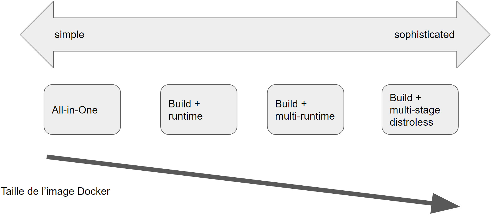
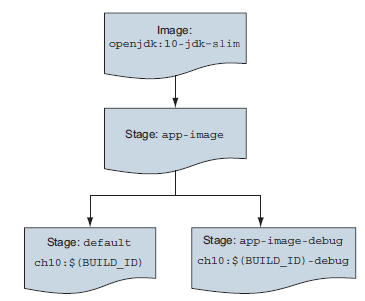

# Lab-build-pattern


Plusieurs modèles existent pour créer des applications et des images à l'aide de conteneurs. 
Ci-dessous trois des modèles les plus populaires :
1. All-in-One : vous utilisez une image tout-en-un pour créer et exécuter l'application.
2. Build Plus Runtime : vous utilisez une image de build avec un runtime séparé et avec une plus petite
image pour créer une application conteneurisée.
3. Build Plus Multiple Runtimes : vous utilisez une image d'exécution res petite avec des variations pour
débogage et autres cas d'utilisation supplémentaires dans une version en plusieurs étapes
4. Distroless: Les images "Distroless" ne contiennent que votre application et ses dépendances d'exécution. 
Elles ne contiennent pas de gestionnaires de packages, de shells ou de tout autre programme 
que vous vous attendriez à trouver dans une distribution Linux standard.

## 1. Build all-in-one 
```shell
 docker image build -t all-in-one -f all-in-one.df .
```
## 2. Separate build 
```shell
docker container run -it --rm -v "$(pwd)":/project/ -w /project maven:3.6-jdk-11 mvn clean verify
```
### Dockerfile simple-runtime.df
```shell
FROM openjdk:11-jdk-slim  # small java jdk image
COPY target/ch10-0.1.0.jar /app.jar # copy the jar file previously compiled
ENTRYPOINT ["java","-jar","/app.jar"] # command for running the web site 
```
### Build 
```shell
docker image build -t simple-runtime -f simple-runtime.df .
```

## 3. Multi-stages


```shell
docker image build -t app-debug --target=app-image-debug-f multi-stage-build.df .
docker image build -t app  --target=app-image -f  multi-stage-runtime.df .
# check the side
```
## 4. Distroless
```shell
docker image build -t app-distroless -f distroless.df .
docker container run --rm -it -p 30080:8080 app-distroless
```

